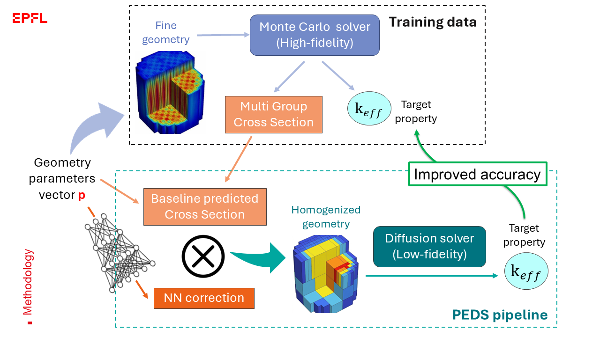

# Physics-Enhanced Deep Surrogate Models for Neutron Transport Solvers (PEDS-NT)

This repository contains the code and data for the Master's thesis **"Physics-Enhanced Deep Surrogate Models for Neutron Transport Solvers"** by Caterina Frau (EPFL – ETH Zürich Joint Master's in Nuclear Engineering, conducted at UC Berkeley). 📄 **[Read the full Master's Thesis (PDF)](thesis_PDF/Caterina_Frau_Master_Thesis.pdf)**

## Overview & Goal

Neutron transport calculations are central to nuclear reactor analysis and design, but high-fidelity continuous-energy Monte Carlo simulations become computationally prohibitive when repeated evaluations are required across large parameter spaces. Conversely, deterministic low-fidelity solvers (such as neutron diffusion) are orders of magnitude faster but introduce physical and spatial approximations that limit their accuracy.

This project adapts the **Physics-Enhanced Deep Surrogate (PEDS)** framework to neutron transport eigenvalue problems. The goal is to bridge the accuracy–cost trade-off: preserving the rapid execution, physical structure, and interpretability of a deterministic diffusion solver while approaching the predictive accuracy of Monte Carlo simulations with minimal training data.

---


## Methodology



As illustrated in the architecture diagram above, the PEDS-NT pipeline couples a neural network generator with an embedded low-fidelity physics solver, trained end-to-end against a high-fidelity reference:

1. **High-Fidelity Reference (**`OpenMC`**):** Continuous-energy Monte Carlo simulations are run over a parameterized reactor geometry vector $\mathbf{p}$ to generate reference values for the effective multiplication factor ($k_{\text{eff}}$) and extract reference multigroup cross sections (MGXS).
2. **Baseline Cross-Section Estimate:** To avoid running Monte Carlo calculations at inference time, a fast polynomial regression model maps the geometry and material parameters $\mathbf{p}$ to an initial coarse estimate of the homogenized MGXS ($\Sigma_{\text{base}}^{\text{MGXS}}(\mathbf{p})$).
3. **Neural Network Generator:** Rather than predicting $k_{\text{eff}}$ directly as a black box, a Multi-Layer Perceptron (MLP) learns a set of multiplicative corrections to refine the baseline cross sections:
  $$
  \Sigma_{\text{final}}^{\text{NN}}(\mathbf{p}) = \Sigma_{\text{base}}^{\text{MGXS}}(\mathbf{p}) \times \text{NN}_{\theta}(\mathbf{p})
  $$
4. **Embedded Low-Fidelity Solver (1D Diffusion):** The corrected MGXS tensor is passed into a custom 1D finite-volume multigroup neutron diffusion solver, which solves the eigenvalue problem on a homogenized spatial grid to output the predicted $k_{\text{eff}}$.
5. **Adjoint-Based Backpropagation (Custom VJP):** Because the external diffusion solver is not natively differentiable, gradients of the loss with respect to the cross sections ($\partial k_{\text{eff}} / \partial \Sigma$) are computed analytically via a custom vector-Jacobian product (VJP) based on the **adjoint neutron flux** ($\phi^\dagger$), enabling fast end-to-end training in JAX without backpropagating through the solver's iterations.

---


## Case Study & Key Results

The framework is evaluated on a 1D cylindrical, two-energy-group reactor core model consisting of three concentric regions (control rod, fuel annulus, and water reflector) defined by a six-parameter design space:

- **Accuracy Improvement:** On the held-out test set, PEDS reduces the mean reactivity discrepancy between the coarse diffusion solver and OpenMC by **~90%** (88.1% across stratified bins).
- **Speed & Data Efficiency:** The low-fidelity surrogate evaluates four orders of magnitude faster than OpenMC (~9 ms per forward solve vs. ~65 s in OpenMC) and reaches optimal performance with a training set of **1,000 samples**.
- **Forward Design Study:** An ensemble of five PEDS models was used to screen 5,000 candidate core geometries for near-criticality ($k_{\text{eff}} \approx 1$) and low radial power peaking factor (PPF) in under 5 minutes. High-fidelity OpenMC verification of the top 30 candidates confirmed 28 viable designs, demonstrating that the upfront training cost is fully recovered after just **four design searches**.

---


## Repository Structure

```
PEDS_NT/
── config_and_run/          # training config and Slurm launchers
├── data/                    # OpenMC reference datasets and merged tables
├── models/                  # PEDS model, training modules, MLP baselines
├── solvers/                 # OpenMC and 1D diffusion solvers
├── example_applications/    # thesis results, comparisons, design study
├── utils/                   # dataset inclusion plots
└── requirements.txt
```

