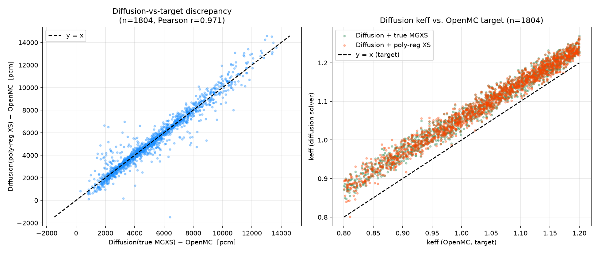

# Full-population "true MGXS vs. poly-regression XS" diffusion study

**Goal.** Confirm — on the *entire* pool of geometries for which an exact,
geometry-matched OpenMC multi-group cross-section (MGXS) set can be found —
that the large keff discrepancy between the diffusion surrogate and the
OpenMC target is *not* an artifact of the polynomial-regression XS model
used as the PEDS pre-training baseline. The original study
(`diff_mesh_1/diffusion_true_xs_results.csv`) established this on a
hand-picked pool of 60 cases (30 "worst" test-set errors + 30 "normal"
cases). This run repeats the identical diffusion comparison on **every**
geometry with a uniquely matched true-MGXS row, i.e. the full population
rather than a curated subsample.

For each matched geometry we solve the 1-D two-group diffusion equation
twice, using the same mesh/solver/boundary conditions as everywhere else
in this project:

- **true MGXS** — the exact per-region OpenMC-extracted cross-sections for
  that specific geometry (`modules/FILES/older_datasets/2jul_full.csv`)
- **poly-reg XS** — the fixed polynomial-regression XS model
  (`predict_xs`, the same PEDS epoch-0 / pre-training baseline used
  throughout the project), which only needs the geometry, not any
  OpenMC-extracted XS

and compare both resulting keff's to the OpenMC target keff for that
geometry.

## Data coverage

| | count |
|---|---|
| Rows in true-MGXS source csv (`2jul_full.csv`) | 2330 |
| LHS samples in target dataset (`LHS_0.8_newbounds.npz`) | 1904 |
| **Uniquely matched geometries used in this study** | **1804** |

A geometry is "matched" when its 6 design parameters uniquely identify a
row in both the MGXS csv and the LHS sample set (tolerance `rtol=atol=1e-4`,
same matching logic as `run_5worstpar_study.py`). The ~23% of MGXS rows
that don't match are geometries from the older MGXS extraction that are no
longer part of the current LHS sample set (or map ambiguously to more than
one LHS row) — these are legitimately excluded, not a data-quality issue in
the matched set.

## Headline result: the discrepancy survives the exact XS

| metric (pcm) | true MGXS vs. OpenMC | poly-reg XS vs. OpenMC |
|---|---:|---:|
| mean \|Δρ\| | 5033.8 | 5043.9 |
| median \|Δρ\| | 4487.1 | 4516.8 |
| std | 2416.8 | 2469.0 |
| p05 – p95 | 1998 – 9894 | 1933 – 9979 |
| RMSE | 5583.6 | 5615.5 |

Even with the **exact, geometry-specific OpenMC MGXS**, the 1-D diffusion
solver disagrees with the OpenMC transport target keff by a median of
**~4487 pcm** (mean ~5034 pcm) — essentially the same order of magnitude as
with the polynomial-regression XS (median ~4517 pcm). This confirms the
original small-sample finding at full-population scale: the dominant
source of the diffusion-surrogate error is the **diffusion approximation /
1-D homogenized-mesh model itself** (transport vs. diffusion physics,
group collapse, mesh resolution), not the polynomial XS regression.

## The two XS sources track each other almost perfectly

| | value |
|---|---:|
| Pearson r (pcm true-MGXS vs. pcm poly-XS, both vs. OpenMC) | **0.971** |
| Spearman r (same) | 0.966 |
| Pearson r (keff true-MGXS vs. keff OpenMC) | 0.988 |
| Pearson r (keff poly-XS vs. keff OpenMC) | 0.987 |
| Fraction of cases with same-sign discrepancy (true vs. poly) | 99.9% |

The correlation is even tighter than in the original 60-case pool
(Pearson r = 0.922 there, vs. 0.971 here) — expected, since that pool was
deliberately over-sampled toward "worst" outliers, which adds scatter.

The XS-regression-specific error — i.e. how much the poly-reg XS itself
adds on top of the true MGXS, isolating the diffusion solver's response to
imperfect XS from the diffusion-approximation error common to both — is an
order of magnitude smaller than the diffusion-approximation gap itself:

| metric (pcm) | poly-XS vs. true-MGXS (diffusion-solver keff only) |
|---|---:|
| mean \|Δ\| | 325.1 |
| median \|Δ\| | 170.1 |
| p95 \|Δ\| | 1158.4 |

i.e. median ≈ 170 pcm from the regression itself vs. median ≈ 4487–4517 pcm
from the diffusion approximation vs. OpenMC — roughly **26x** smaller.

## What drives the residual diffusion-approximation error

Pearson correlation of each geometry parameter with the true-MGXS
discrepancy (`pcm_true_mgxs_minus_openmc`, all values positive so signed
and absolute correlations coincide):

| parameter | r |
|---|---:|
| `r1_fuel_annulus_outer_radius` | **-0.843** |
| `r1_fuel_annulus_f_mod` | 0.113 |
| `r1_fuel_annulus_enrichment` | 0.089 |
| `r2_water_outer_radius` | -0.037 |
| `r0_b4c_rod_outer_radius` | -0.028 |
| `r0_b4c_rod_cr_fraction` | 0.015 |

The fuel-annulus outer radius (i.e. overall core size) is by far the
dominant driver: **larger cores are much better approximated by diffusion
theory** (less leakage/transport effect relative to core size), while
small, compact cores — where transport effects near the strongly absorbing
B4C control rod and the core boundary are strongest — show the largest
diffusion-vs-transport gap. All other geometry knobs (control-rod size,
enrichment, moderation, reflector thickness) have a comparatively minor
effect on this gap.

## Supporting figure



*Left:* poly-reg-XS discrepancy vs. true-MGXS discrepancy for all 1804
matched geometries — tightly clustered around the `y = x` line (r = 0.971).
*Right:* diffusion-solver keff (with both XS sources) vs. the OpenMC target
keff — both XS sources show the same systematic diffusion-vs-transport
offset from the `y = x` line, of comparable magnitude.

## Conclusion

Extending the original 60-case study to the full population of 1804
geometries with matched true OpenMC MGXS confirms and strengthens the
original conclusion: **the large keff discrepancy between the diffusion
surrogate and OpenMC is present, and of essentially the same magnitude,
whether the diffusion solver is fed the exact OpenMC-extracted MGXS or the
polynomial-regression-predicted XS.** The polynomial regression itself
contributes a comparatively small amount of additional error (median
~170 pcm) on top of a diffusion-approximation gap that is roughly 26x
larger (median ~4500 pcm) and driven predominantly by core size
(`r1_fuel_annulus_outer_radius`). This is now demonstrated at
population scale (n = 1804), not just on the earlier 60-case subsample.

## Files in this study

- `full_true_xs_results.csv` — per-case results (keff's, pcm discrepancies,
  geometry parameters) for all 1804 matched geometries
- `full_true_xs_summary_stats.csv` — one-row aggregate + correlation
  statistics table (means/medians/std/percentiles, Pearson/Spearman
  correlations, RMSEs, per-parameter correlations)
- `full_study_scatter_summary.png` — supporting scatter plots
- `FULL_STUDY_SUMMARY.md` — this write-up

Reproduce with:

```bash
cd modules/MOREstudies/0small_studies
sbatch run_full_true_xs_study.sh
```

(`run_full_true_xs_study.py` is the underlying script; it matches every row
of `modules/FILES/older_datasets/2jul_full.csv` to a unique LHS sample in
`data/highfidelity/LHS_0.8_newbounds.npz`, then runs the diffusion solver
with the true MGXS and with `predict_xs` for each matched geometry.)
